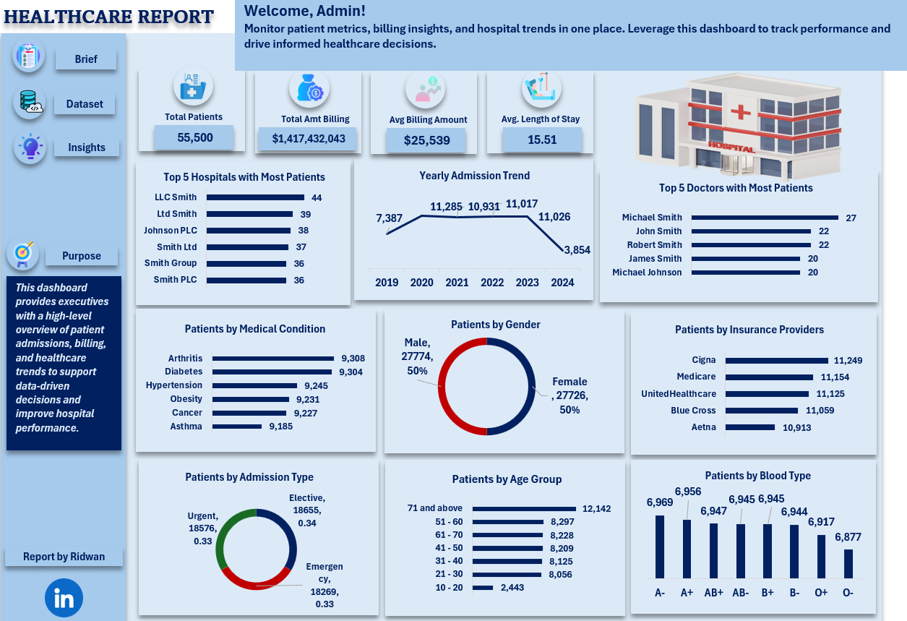

# 🏥 Healthcare Report 

## Project Overview
This project provides a **comprehensive healthcare dashboard** to monitor metrics, billing insights, and trend trends.
The dashboard is designed for **executives and hospital administrators to track performance, identify patterns and drive data-driven heathcare decisions.

**Live Project:** [View Dashboard](https://1drv.ms/x/c/cbc72564bad1f538/EWRnizvs8ahPriOwqJz1muIB3nfgZYTkPBHfohzNSSXTeA?e=3Pb7An)

---
## Purpose
- Provide a **high-level overview** of hospital admissions, billing, and patient demographics
- Support **data-driven decision making** to improve healthcare performance

  ## Key Insights from Dashboard
  - **Total Patients:** 55,000
  - **Total Billing Amount:** 1,417,432,043
 
  ## Tools & Technologies
  - **Excel** Dashboard dsign and data visualization
  - **Healthcare Dataset** (simulated, 55,000 patient records)

    ---

    ## Dashboard Preview
    

    ## Author
    **Ridwan Ibrahim**
    
